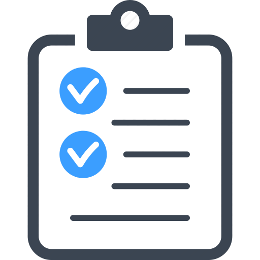

<h1 align="center">
    
    <p> Todo List </p>
</h1>


# Prova de Avaliação Técnica

Esta Prova consiste em desenvolver uma aplicação WEB feita em ReactJS para fim de avaliação Técnica no processo seletivo da Tecmite.

# Aplicação

A aplicação que será desenvolvida é um sistema de lista de afazeres (Todo-List). Aonde o usuário poderá adicionar tarefas na lista, categorizar as tarefas, adicionar lembretes, Data da Tarefa.

A tarefa deverá conter um título, um corpo de texto, uma categoria, uma data inicio e fim (opcional).

### :pencil: Requerimentos

_Programas necessários:_
* [Git](https://git-scm.com)
* [Node](https://nodejs.org/)
* [Yarn](https://yarnpkg.com/)
* [Docker](https://www.docker.com/)


### 🗄️ Base de dados da aplicação
- [Postgres](https://github.com/postgres/postgres)
- [Redis](https://redis.io/)

# 🗄️ Criar as bases de dados

```
# Criar um container com a imagem do Postgres
docker run --name todolist -e POSTGRES_PASSWORD=todolist -p 5432:5432 -d postgres
(O login e senha serão: todolist)

# Criar um container com a imagem do Redis
docker run --name redis -p 6379:6379 -d -t redis:alpine

# Inicie o container do Postgres
docker start todolist

# Inicie o container do Redis
docker start redis

```

# 🖥 Iniciando a API REST

1. Clonar o repositório com `git clone https://github.com/jvrviegas/prova-full-stack.git`
2. Entre dentro da pasta do projeto com `cd prova-full-stack/backend`
3. Instale todas as dependências com o comando `yarn`
4. Criar a base de dados todolist utilizando o gerenciador de preferência (aconselho o [Postbird](https://www.electronjs.org/apps/postbird))
5. Executar as migrations:
6. `yarn sequelize db:migrate`
7. Para excutar a api execute o comando a seguir no terminal:
8. `yarn dev` 
9. Para executar as filas execute no terminal 
10. `yarn queue`

# 💻 Iniciando a plataforma web

1. Abra um terminal entre na pasta `cd prova-full-stack/frontend`
2. Instale todas as dependências com o comando `yarn`
3. Para inicializar a plataforma execute o comando: 
4. `yarn start`
5. Uma nova aba do navegador abrirá na url http://localhost:3000 
6. Efetue o cadastro e login na plataforma: 

# :hammer: Ferramentas utilizadas

- ⚛️ **Node.js** - É uma Biblioteca JavaScript para criar mobile Apps 
- ⚛️ **ReactJs** - É uma Biblioteca Javascript para criar interfaces de usuário.
- 💅 **Styled Components** - É uma Biblioteca Javascript pra estilizar componentes.
- 📄 **Axios** - É uma Biblioteca Javascript para fazer requisições http
- 📄 **ESLint** - É uma Biblioteca Javascript para procurar e resolver problemas de identação e outros no código
- 📄 **Redux** - É um controlador de estados gerais da aplicação.
- 📄 **Redux-saga** - É Biblioteca que foca em fazer os efeitos colaterais (ex: chamadas assíncronas).
- 📄 **react-toastify** - É Biblioteca para criar toasts para web.
- 📄 **Immer** - É Biblioteca para alterar estados usando draft(rascunho).
- 📄 **React Router** - Permite trabalhar com rotas no React JS.

